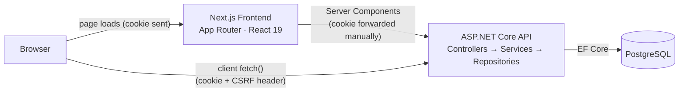

# Big If True

A campaign-management tool for tabletop RPG Dungeon Masters, built end-to-end as a portfolio project: authentication and per-user data ownership, a relational domain model (campaigns, cities, locations, NPCs, and quests), a quest dependency graph with cycle detection and a persisted layout, and global search — with an emphasis on the architecture and decisions behind each of those, not just CRUD screens.

## Screenshots

*(Not included in the repository yet — capture and drop into `docs/screenshots/` when available.)* Worth capturing: the Campaign list, a Quest detail page with its objectives checklist, the Quest Graph view, and the Global Search overlay open mid-search.

## Key Features

**Campaign management** — Campaigns, Cities, Locations, NPCs, and Quests, each with full CRUD, scoped to the owning user on every read and write.

**Relationships** — NPCs can be linked to Locations, Quests to NPCs, and Quests to Locations, each relationship carrying its own role/notes metadata rather than being a bare join. Quests can also connect to each other through six relationship types (e.g. `Unlocks`, `Related`), forming a dependency graph with cycle detection and a per-quest layout that's saved and restored (drag a node, reload, it's still there).

**Quest objectives** — an ordered checklist per quest, reorderable and independently completable.

**Authentication & security** — cookie-based auth (register/login/logout) with CSRF protection, and ownership enforced server-side on every single query — a user can never read or write another user's data, by construction rather than by convention.

**Global search** — `Ctrl/Cmd+K` opens a command-palette-style overlay searching across all five entity types by name, ranked (exact > prefix > contains) and scoped to the current user's own data.

**Not implemented** (out of scope for this project as it stands): world maps, battle maps, encounters, compendiums, player-facing accounts or sharing, AI features, notifications.

## Architecture



**Backend** follows a conventional layered structure: `CampaignApp.Api` (controllers, thin — no business logic), `CampaignApp.Application` (services, DTOs, business logic), `CampaignApp.Infrastructure` (EF Core, repositories, migrations), `CampaignApp.Domain` (entities, no framework dependencies). Controllers depend on service interfaces, never repositories directly.

**Frontend** is a Next.js App Router application. Data access is split by call site rather than by read/write: `lib/server-api.ts` is for Server Components (imports `next/headers`, marked `server-only` so it can never accidentally ship to the client), and `lib/api.ts` is for anything triggered from a Client Component — including reads like search, when the read itself is user-driven-as-you-type rather than page-load data.

One notable Next.js characteristic worth documenting rather than treating as a bug: a `notFound()` call from within a *nested layout* (as opposed to a leaf page) renders the correct themed 404 content but returns HTTP `200`, confirmed against an actual production build (`next build && next start`), not just dev mode. This is a known App Router streaming characteristic — the response status has typically already been committed by the time a nested layout's async check resolves — not something introduced by this app. It has no functional or security impact: the right content is shown, and ownership enforcement happens server-side regardless of the eventual status code. Fixing the status code would mean restructuring layout boundaries or disabling streaming for that subtree, which isn't worth doing for a cosmetic status-code mismatch.

## Technology Stack

- **Backend**: ASP.NET Core 8, Entity Framework Core 8, PostgreSQL 16 (via Npgsql), xUnit
- **Frontend**: Next.js 16 (App Router), React 19, TypeScript, Tailwind CSS v4
- **Infra**: Docker Compose (PostgreSQL only — the API and frontend run natively in local development; see [Deployment](docs/DEPLOYMENT.md) for a production shape)

## Local Setup

**Prerequisites**: .NET 8 SDK (pinned via `global.json` to `8.0.419`), Node.js 20+, Docker.

```bash
git clone https://github.com/ethancarpenter/Big-If-True.git
cd Big-If-True
cp .env.example .env
cp frontend/.env.example frontend/.env.local
```

## Environment Variables

| File | Variable | Purpose |
|---|---|---|
| `.env` (root, from `.env.example`) | `POSTGRES_USER` / `POSTGRES_PASSWORD` / `POSTGRES_DB` / `POSTGRES_PORT` | Local Postgres container credentials, consumed by `docker-compose.yml` |
| `frontend/.env.local` (from `frontend/.env.example`) | `NEXT_PUBLIC_API_URL` | Base URL the frontend calls the backend at (`http://localhost:5080` locally) |

The Postgres credentials in `.env.example` and hardcoded in `backend/CampaignApp.Api/appsettings.Development.json` (`campaignapp` / `campaignapp_dev`) are intentional, documented local-only defaults — they only ever address your own Docker container on `localhost`, never anything externally reachable, so they're safe to commit and aren't a leaked secret.

## Running the Database, Backend, and Frontend

Three separate local processes (the app itself isn't containerized yet — a deliberate scope decision from early in the project, not an oversight):

```bash
# 1. Database
docker compose up -d postgres

# 2. Backend (from backend/CampaignApp.Api)
dotnet ef database update --project ../CampaignApp.Infrastructure --startup-project .
dotnet run

# 3. Frontend (from frontend/)
npm install
npm run dev
```

Backend runs at `http://localhost:5080`, frontend at `http://localhost:3000`.

In development, the backend also seeds two accounts on startup (idempotent — safe across restarts, and structurally impossible in production since it's gated behind `IsDevelopment()`):

| Account | Email | Password | Purpose |
|---|---|---|---|
| Dev | `dev@local.test` | `DevPassword123!` | Hand-curated data accumulated across development |
| Demo | `demo@local.test` | `DemoPassword123!` | A clean, self-contained campaign for reviewing the app without depending on the dev account's data |

## Migrations

Add a migration after changing an entity or `DbContext` configuration:

```bash
dotnet ef migrations add <Name> --project CampaignApp.Infrastructure --startup-project CampaignApp.Api
dotnet ef database update --project CampaignApp.Infrastructure --startup-project CampaignApp.Api
```

One migration, `AddUsersAndCampaignOwnerFk`, includes hand-authored conditional seed SQL (`INSERT ... WHERE EXISTS (...)`) rather than an environment check, so it behaves identically and safely against any fresh database — including CI and production — instead of depending on `ASPNETCORE_ENVIRONMENT`.

## Testing

```bash
cd backend
dotnet test
```

224 tests, all running against EF Core's InMemory provider — no database connection required. There is no frontend test suite yet.

## Authentication & Security Overview

- Cookie-based authentication (register/login/logout), with CSRF protection via a hand-rolled `AntiforgeryValidationFilter` (a plain `AddControllers()` API doesn't have the MVC ViewFeatures services `[AutoValidateAntiforgeryToken]` needs).
- A global `RequireAuthenticatedUser()` fallback policy — every endpoint requires authentication unless explicitly opted out.
- Ownership is enforced structurally, not as an afterthought: every repository filters by the current user's ownership (`Campaign.UserId`, or the owning campaign's `UserId` for nested entities) as part of the query itself, via `ICurrentUserProvider`.
- These are development-mode assumptions. Production hosting has specific additional requirements (HTTPS, cookie domain topology, CORS origins) — see [`docs/DEPLOYMENT.md`](docs/DEPLOYMENT.md).

## Major Technical Decisions

- **Layered architecture** (Api → Application → Infrastructure → Domain) to keep business logic out of controllers and testable independently of ASP.NET Core.
- **Explicit relationship entities** (`NpcLocation`, `QuestNpc`, `QuestLocation`) instead of generic many-to-many join tables, since each relationship carries its own metadata (role, notes).
- **BFS cycle detection** on the quest graph, scoped only to progression-asserting connection types — simple and sufficient for the graph sizes this app deals with, at the cost of not being the most asymptotically efficient general-purpose algorithm.
- **Persisted graph positions as a separate entity** (`QuestGraphPosition`) rather than columns on `Quest`, keeping graph-layout concerns out of the core Quest model.
- **Search composed from existing repositories** rather than a new search-specific data store or index — appropriate at this data scale, avoids introducing a new piece of infrastructure for a name-only search feature.

## Project Status / Future Roadmap

Feature-complete for its current scope: campaign/city/location/NPC/quest management, relationships, the quest graph, auth, and global search — all implemented and tested. Explicitly **not** built: world maps, battle maps, encounters, compendiums, player-facing sharing, AI features, notifications. This milestone (Portfolio and Production Readiness) adds documentation, demo data, CI, and accessibility/responsive polish — it does not add new domain features, and production hosting itself has not been exercised (see [`docs/DEPLOYMENT.md`](docs/DEPLOYMENT.md) for what that would require).
