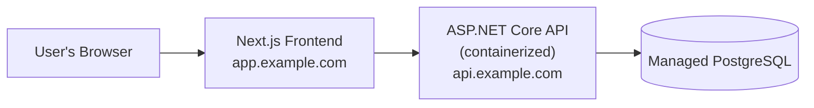

# Deployment

This document describes what production hosting would require and one reasonable architecture for it. **Nothing here is deployed.** It exists so the gap between "works in local development" and "safe to put on the public internet" is explicit rather than assumed away.

## Production authentication assumptions

The authentication design (Milestone 10) is cookie-based, which makes a few things true in production that don't matter in local development:

- **HTTPS is required, not optional.** `CookieSecurePolicy` is `SameAsRequest` in development and `Always` in every other environment. A production deployment served over plain HTTP would never actually receive the auth or antiforgery cookies — login would silently appear to succeed and then behave as if the user were logged out on the very next request.
- **Hostname topology matters.** Cookies are host-scoped but port-agnostic, which is why `localhost:3000` (frontend) and `localhost:5080` (backend) work together with zero extra configuration in development — they're the same host. That does **not** generalize to two unrelated production domains (e.g. a frontend on Vercel and a backend on a different provider's default domain) — the cookie's `Domain` has nowhere valid to point. The frontend and backend need to be deployed as **sibling subdomains of one parent domain** (e.g. `app.example.com` and `api.example.com`), with the cookie `Domain` set to the shared parent (`.example.com`), or unified behind a single reverse-proxied origin.
- **CORS origins must be updated.** `AllowedOrigins` is currently just `["http://localhost:3000"]`, set in `appsettings.Development.json`. Production needs its own origin list — via `appsettings.Production.json` or an environment variable override — pointing at the real deployed frontend URL(s).
- **CSRF follows the same constraints as the auth cookie.** The antiforgery cookie is subject to the identical Secure/hostname requirements above, for the same reason.

## Proposed architecture (not built)

- **API**: containerized (no `Dockerfile` exists yet — writing one is future work, not part of this milestone) and run behind any standard container host.
- **Database**: a managed PostgreSQL instance rather than a self-run container, for backups/patching/failover without custom operational work.
- **Frontend**: either a native Next.js host (e.g. Vercel) or containerized alongside the API — either works, since nothing about the frontend depends on being co-located with the backend process.
- **Cookie topology**: use either one reverse-proxied origin or sibling subdomains with the shared cookie domain configured, as described above.

The CI workflow added in this milestone (`.github/workflows/ci.yml`) is a natural place to eventually add a deploy job once a real target is chosen. That's explicitly not part of this milestone.

## Secrets and credentials review

Reviewed directly against what's actually committed:

- `.env` and `frontend/.env.local` are correctly gitignored; only their `.example` counterparts are tracked, and neither contains a real secret.
- The Postgres password in `.env.example` and `appsettings.Development.json` (`campaignapp_dev`) is a public development default. Docker Compose binds its published port to `127.0.0.1`. Preserve that binding for local development; use separate secrets for production. The backend does not read the root `.env`: custom local database values also require a matching `ConnectionStrings__DefaultConnection` override, as shown in the root README.
- The seeded `dev@local.test` account (Milestone 10) and `demo@local.test` account (this milestone) are both gated behind `IsDevelopment()` in `Program.cs` — structurally unreachable in production regardless of any other configuration, not just disabled by convention.
- `bin/`, `obj/`, `node_modules/`, and `.next/` are all correctly gitignored generated artifacts.

Nothing found that's committed and shouldn't be. A real production deployment would still need its own secrets (a production database connection string, a distinct set of allowed CORS origins) supplied via environment variables or a secrets manager — never committed, and not created by this milestone since nothing is actually being deployed.
